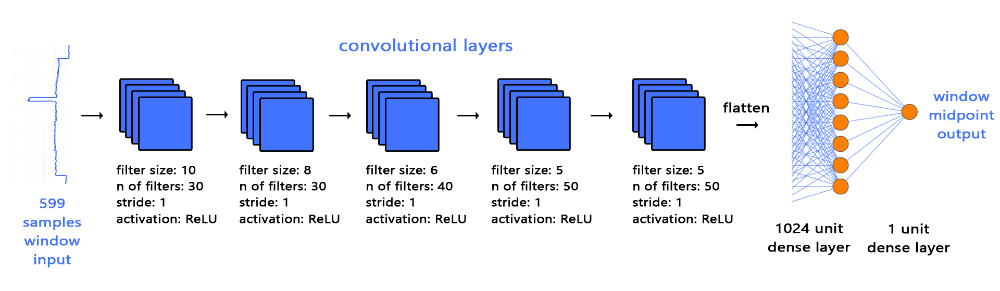
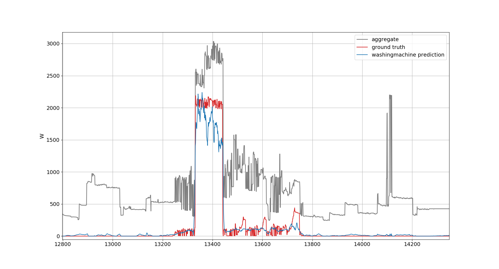

# Transfer learning for non-intrusive load monitoring (energy disaggregation)
This code implements the sequence-to-point (seq2point) learning model which was propsoed in [2]. The code then implements transfer learning for NILM. Precisely, we studied transfer learning for NILM using the seq2point learning framework. 

We proposed two approaches for transfer learning: 

[1] One is cross-domain transfer learning where you we want to transfer knowledge from domain to domain, for example, we can train a model on UK data and transfer the trained model to US households; 

[2] The other is appliance transfer learning where you want to transfer learned knowledge from appliance to applaince, for example, we can train a model on Washing Machine and then transfer it to Kettle. For more details, see the paper [1].

This code is written by Michele D'Incecco and Mingjun Zhong based on the code from
https://github.com/MingjunZhong/NeuralNetNilm 

Any questions please drop me an email at mzhong@lincoln.ac.uk

References:

[1] DIncecco, Michele, Stefano Squartini, and Mingjun Zhong. "Transfer Learning for Non-Intrusive Load Monitoring." IEEE Transactions on Smart Grid, (accepted on 20 August 2019.)(arXiv preprint arXiv:1902.08835)

[2] Chaoyun Zhang, Mingjun Zhong, Zongzuo Wang, Nigel Goddard, and Charles Sutton. "Sequence-to-point learning with neural networks for nonintrusive load monitoring."
Thirty-Second AAAI Conference on Artificial Intelligence (AAAI-18), Feb. 2-7, 2018.

Seq2point model: the input is the mains windows (599 timepoints); and output is the midpoint of the corresponding appliance windows.





**Requirements**

0. This software was tested on Ubuntu 16.04 LTS

1. Create your virtual environment Python > 3.5

2. Install Tensorflow > 1.4

    * Follow official instruction on https://www.tensorflow.org/install/
    
    * Remember a GPU support is highly recommended for training
    
3. Install Keras > 2.1.5

    * Follow official instruction on https://keras.io/
    
4. Clone this repository
    

For instance, the environments we used are listed in the file `environment.yml` - 
you could find all the packages there. If you use `conda`, 
you may type `conda env create -f environment.yml` to set up the environment.
    

# How to use the code and examples
With this project you will be able to use the Sequence to Point network. You can prepare the dataset from the
most common in NILM, train the network and test it. Target appliances taken into account are kettle, microwave, fridge, dish washer and
washing machine.
Directory tree:

``` bash
├── Arguments.py
├── cnnModel.py
├── DataProvider.py
├── dataset_management
│   ├── functions.py
│   ├── redd
│   │   ├── create_trainset_redd.py
│   │   └── redd_parameters.py
│   ├── refit
│   │   └── create_dataset.py
│   └── ukdale
│       ├── create_trainset_ukdale.py
│       └── ukdale_parameters.py
├── environment.yml
├── images
│   ├── model.png
│   ├── s2p.png
│   └── washingmachine.png
├── Logger.py
├── models
├── NetFlowExt.py
├── nilm_metric.py
├── result
├── seq2point_test.py
└── seq2point_train.py
```

## **Create REFIT, UK-DALE or REDD dataset**

This script allows the user to create CSV files of training dataset of power measurments.
The output will be 3 CSV files for training, validation and test. 

You should select the following arguments for the argument parser:
`python create_dataset -h`

```
--data_dir DATA_DIR             The directory containing the CLEAN REFIT data

--appliance_name APPLIANCE_NAME which appliance you want to train: kettle,
                                microwave,fridge,dishwasher,washingmachine

--aggregate_mean AGGREGATE_MEAN Mean value of aggregated reading (mains)

--aggregate_std AGGREGATE_STD   Std value of aggregated reading (mains)

`--save_path SAVE_PATH           The directory to store the training data
```


Example:

Create a REFIT dataset (mains and appliance power measurments) for kettle:

`python create_dataset.py --data_dir './' --appliance_name 'kettle' --aggregate_mean 522 --aggregate_std 814 --save_path './'`
    
### **REFIT**

Download the REFIT raw data from the original website (https://pureportal.strath.ac.uk/en/datasets/refit-electrical-load-measurements-cleaned). 
Appliances and training set composition for this project:

| Appliances      |      training                    |  validation | test   |
|-----------------|:--------------------------------:|:-----------:|:------:|
| kettle          | 3, 4, 6, 7, 8, 9, 12, 13, 19, 20 |     5       |   2    |
| microwave       | 10, 12, 19                       |    17       |   4    |
| fridge          | 2, 5, 9                          |     12      |   15   |
| dish washer     | 5, 7, 9, 13, 16                  |     18      |   20   |
| washing machine | 2, 5, 7, 9, 15, 16, 17           |      18     |   8    |


### **UK-DALE**

Download the UK-DALE raw data from the original website (http://jack-kelly.com/data/). 
Validation is a 13% slice from the final training building. 
Appliances and training set composition for this project:

| Appliances      |      training   |  validation | test   |
|-----------------|:---------------:|:-----------:|:------:|
| kettle          | 1               |     1       |   2    |
| microwave       | 1               |     1       |   2    |
| fridge          | 1               |     1       |   2    |
| dishwasher      | 1               |     1       |   2    |
| washingmachine  | 1               |     1       |   2    |


### **REDD**

Download the REDD raw data from the original website (http://redd.csail.mit.edu/).
Validation is a 10% slice from the final training building. 
Appliances and training set composition for this project:

| Appliances      |      training   |  validation | test   |
|-----------------|:---------------:|:-----------:|:------:|
| microwave       | 2,3             |     3       |   1    |
| fridge          | 2,3             |     3       |   1    |
| dishwasher      | 2,3             |     3       |   1    |
| washingmachine  | 2,3             |     3       |   1    |


## **Training**
The seq2point_train.py script is the entry point for the training phase. It loads the training dataset, including validation, and it starts the training.
It uses a script to load CSV dataset file into memory, prepares pairs of 599 samples aggregate data and 1 sample midpoint ground truth.
After randomly shuffle them, batches of BATCHSIZE size are input to the network for backpropagation purpose.
Once the training is cmplete, according to the eary stopping criterion, the trained KERAS model (and model's parameters) will be available into the folder you have selected.

Training default parameters:

* Input window: 599 samples

* Number of maximum: epochs 50

* Batchsize: 1000

* Early stopping
    * min epochs: 5
    * patience: 5

* Adam optimiser:
    * Learning rate: 0.001   
    *  Beta1:  0.9
    *  Beta2: 0.999    
    *  Epsilon: 10^{-8}


`python seq2point_train.py --help`

```
optional arguments:
  -h, --help            show this help message and exit
  --appliance_name APPLIANCE_NAME
                        the name of target appliance
  --datadir DATADIR     this is the directory of the training samples
  --pretrainedmodel_dir PRETRAINEDMODEL_DIR
                        this is the directory of the pre-trained models
  --save_dir SAVE_DIR   this is the directory to save the trained models
  --batchsize BATCHSIZE
                        The batch size of training examples
  --n_epoch N_EPOCH     The number of epochs.
  --save_model SAVE_MODEL
                        Save the learnt model: 0 -- not to save the learnt
                        model parameters; n (n>0) -- to save the model params
                        every n steps; -1 -- only save the learnt model params
                        at the end of training.
  --dense_layers DENSE_LAYERS
                        : 1 -- One dense layers (default Seq2point); 2 -- Two
                        dense layers; 3 -- Three dense layers.
  --transfer_model TRANSFER_MODEL
                        True: using entire pre-trained model. False: retrain
                        the entire pre-trained model; This will override the
                        'transfer_cnn' and 'cnn' parameters; The
                        appliance_name parameter will use to retrieve the
                        entire pre-trained model of that appliance.
  --transfer_cnn TRANSFER_CNN
                        True: using a pre-trained CNN False: not using a pre-
                        trained CNN.
  --cnn CNN             The CNN trained by which appliance to load (pretrained
                        model).
  --gpus GPUS           Number of GPUs to use: n -- number of GPUs the system
                        should use; -1 -- do not use any GPU.
  --crop_dataset CROP_DATASET
                        for debugging porpose should be helpful to crop the
                        training dataset size
  --ram RAM             Maximum number of rows of csv dataset can handle
                        without loading in chunks

```

Example:

Train the whole model, randomly initialised, using 10000 data points:

`python seq2point_train.py --appliance_name 'kettle' --datadir './dataset_management/refit/' --save_dir './trained_model' --transfer_model False --crop_dataset 10000`

Transfer learning: train the whole model, starting from a pre-trained model: you must provide the pre-trained model directory (kettle in this example).

`python seq2point_train.py --appliance_name 'kettle' --datadir './dataset_management/refit/' --save_dir './trained_model' --transfer_model True --pretrainedmodel_dir './pretrained_model' --crop_dataset 10000`

Transfer learning: only train the dense layers starting from a pre-trained CNN; you must provide the pre-trained model directory (washingmachine in this example).

`python seq2point_train.py --appliance_name 'kettle' --datadir './dataset_management/refit/' --save_dir './trained_model' --transfer_cnn True --cnn washingmachine --pretrainedmodel_dir './pretrained_model' --crop_dataset 10000`

## **Test**
The seq2point_test.py script is the entry point for testing the network. In a similar way to the training windows are prepared, without shuffling, and sent to the network.
The prediction is stored and saved in .npy file together with aggregate and ground truth. If selected, the script will generate a plot (an example below).

`python seq2point_test.py -h`

```
optional arguments:
  -h, --help            show this help message and exit
  --appliance_name APPLIANCE_NAME
                        the name of target appliance
  --datadir DATADIR     this is the directory to the test data
  --trained_model_dir TRAINED_MODEL_DIR
                        this is the directory to the trained models
  --save_results_dir SAVE_RESULTS_DIR
                        this is the directory to save the predictions
  --nosOfWindows NOSOFWINDOWS
                        The number of windows for prediction for each
                        iteration.
  --test_type TEST_TYPE
                        Type of the test set to load: test -- test on the
                        proper test set; train -- test on a aready prepared
                        slice of the train set; val -- test on the validation
                        set; uk -- test on UK-DALE; redd -- test on REDD.
  --dense_layers DENSE_LAYERS
                        : 1 -- One dense layers (default Seq2point); 2 -- Two
                        dense layers; 3 -- three dense layers the CNN.
  --transfer TRANSFER   Using a pre-trained CNN (True) or not (False).
  --plot_results PLOT_RESULTS
                        To plot the predicted appliance against ground truth
                        or not.
  --cnn CNN             The trained CNN by which appliance to load.
  --crop_dataset CROP_DATASET
                        for debugging porpose should be helpful to crop the
                        test dataset size
```                                 
Example:

Test the model using 10000 data points:

`python seq2point_test.py --appliance_name 'kettle' --datadir './dataset_management/refit/' --trained_model_dir './trained_model' --save_results_dir './result' --transfer False --crop_dataset 10000 --plot_results False`

Transfer learning (Testing on kettle, but the CNN was trained by using washing machine):

`python seq2point_test.py --appliance_name 'kettle' --datadir './dataset_management/refit/' --trained_model_dir './trained_model' --save_results_dir './result' --transfer True --cnn washingmachine --crop_dataset 10000 --plot_results False`


Test output example plot for washing machine:

